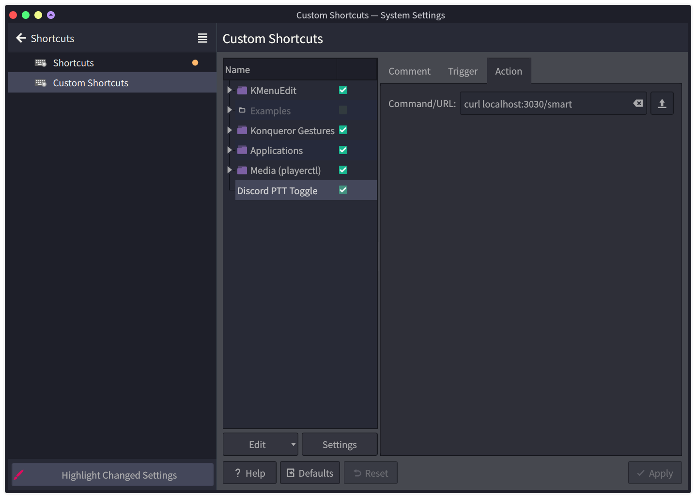

# Wayland Discord Push To Talk

> This is a workaround to mimic the push-to-talk functionality of Discord on Wayland.

Since Wayland does not allow global keybindings, this plugin spins up a Node.js server in the background and listen on port `3030`. Once received a request, it then change the mute state of Discord accordingly.

## Installation

1. Install [BetterDiscord](https://github.com/BetterDiscord/Installer).
2. Download `PTTServer.plugin.js` and put it in the `plugins` folder.
3. Enable the plugin.
4. Setup a keybinding in your compositor to send a request to the server.

   e.g. This is my setup in KDE, I mapped one of my mouse buttons to the `F14` key, and then map `F14` to send a `curl` request to `localhost:3000/smart`.
   

   _Update:_ Now I included a debounce script, setup an action on keypress to run the script will also do the job.

5. Finally, make sure your Discord is in **Voice Activity** mode.

## API

- `/smart` - The recommended way to push-to-talk, calling this endpoint will make the user unmute and mute the use once they stop talking for 750ms. Calling this endpoint repeatedly will keep the user unmuted until stop requesting and the user stop talking.
- `/toggle` - Toggle the mute state.
- `/start` - Unmute.
- `/stop` - Mute.
